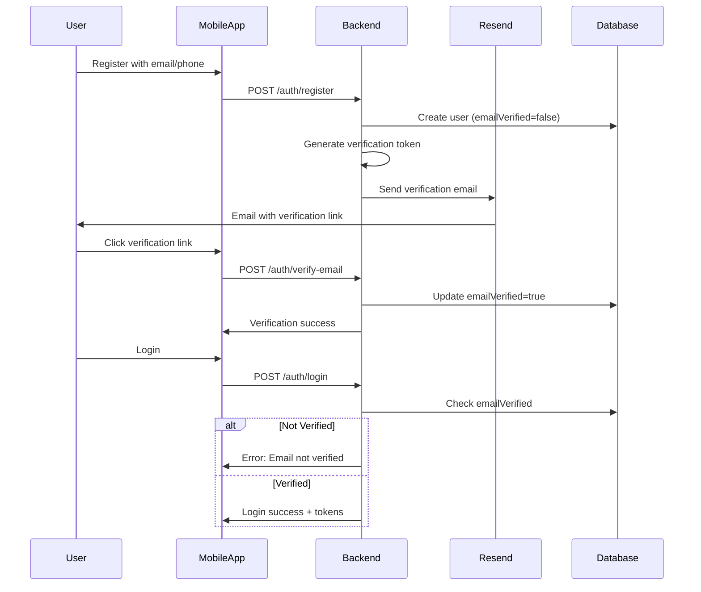

# Email Verification and

Invitation System Implementation

## Overview

Implement email verification for user registration and email-based caregiver invitations using Resend email service (free tier: 3,000 emails/month). Unverified users will be blocked from logging in until they verify their email address.

## Architecture Flow




## Implementation Steps

### 1. Database Schema Updates

**File:** `backend/prisma/schema.prisma`Add verification fields to User model:

- `emailVerified` (Boolean, default: false)
- `verificationToken` (String?, unique, nullable)
- `verificationTokenExpiresAt` (DateTime?, nullable)

Create migration:

```bash
npx prisma migrate dev --name add_email_verification
```


### 2. Email Service Module

**New Files:**

- `backend/src/email/email.module.ts`
- `backend/src/email/email.service.ts`
- `backend/src/email/templates/verification-email.template.ts`
- `backend/src/email/templates/caregiver-invitation-email.template.ts`

**Dependencies to install:**

```bash
npm install resend
```

**Email Service Features:**

- Send verification emails with token link
- Send caregiver invitation emails with invite code
- Resend verification emails
- Email template management

**Configuration:**Add to `.env`:

```javascript
RESEND_API_KEY=your_resend_api_key
FRONTEND_URL=http://localhost:3000
APP_NAME=Digital Nurse
```


### 3. Backend Auth Service Updates

**File:** `backend/src/auth/auth.service.ts`**Changes:**

- Generate verification token on registration
- Store token in database with expiration (24 hours)
- Send verification email after registration
- Implement `verifyEmail()` method to validate tokens
- Add `resendVerificationEmail()` method
- Update `login()` to check `emailVerified` status

**New Endpoints:**

- `POST /auth/resend-verification` - Resend verification email

### 4. Backend Caregiver Service Updates

**File:** `backend/src/caregivers/caregivers.service.ts`**Changes:**

- Update `sendInvitation()` to send actual email via email service
- Include invite code and registration link in email
- Add email template for caregiver invitations

### 5. Mobile App Updates

**Files to update:**

- `mobile/lib/features/auth/screens/register_screen.dart`
- `mobile/lib/features/auth/screens/email_verification_screen.dart`
- `mobile/lib/features/auth/screens/login_screen.dart`
- `mobile/lib/core/services/auth_service.dart`
- `mobile/lib/core/providers/auth_provider.dart`

**Changes:**

- After registration, redirect to email verification screen
- Show verification status and resend option
- Handle deep links for email verification
- Update login to show error if email not verified
- Add resend verification email functionality

**New Route:**

- Deep link handler for `/email-verification?token=xxx`

### 6. Error Handling

**Backend:**

- Return clear error messages for unverified users
- Handle expired verification tokens
- Rate limit verification email resends (max 3 per hour)

**Mobile:**

- Show user-friendly error messages
- Provide resend verification email option
- Handle token expiration gracefully

## Free Email Service: Resend

**Why Resend:**

- Free tier: 3,000 emails/month (100/day)
- Easy API integration
- Good deliverability
- Modern developer experience
- Transactional email focused

**Setup Steps:**

1. Sign up at https://resend.com
2. Get API key from dashboard
3. Add to backend `.env` file
4. Domain verification (optional for production)

**Alternative (if needed):**

- SendGrid: 100 emails/day free
- Mailgun: 5,000 emails/month (3 months free trial)

## Security Considerations

1. **Token Security:**

- Use cryptographically secure random tokens (32+ characters)
- Set expiration (24 hours)
- One-time use tokens (invalidate after verification)

2. **Rate Limiting:**

- Limit verification email resends (3 per hour per user)
- Prevent email enumeration attacks

3. **Email Validation:**

- Validate email format before sending
- Handle bounce/complaint emails (future enhancement)

## Testing Checklist

- [ ] User registration sends verification email
- [ ] Verification link works and updates user status
- [ ] Unverified users cannot login
- [ ] Verified users can login successfully
- [ ] Resend verification email works
- [ ] Expired tokens are rejected
- [ ] Caregiver invitation emails are sent
- [ ] Email templates render correctly
- [ ] Deep links work in mobile app

## Files to Create/Modify

### Backend

- `backend/prisma/schema.prisma` (modify)
- `backend/src/email/email.module.ts` (new)
- `backend/src/email/email.service.ts` (new)
- `backend/src/email/templates/verification-email.template.ts` (new)
- `backend/src/email/templates/caregiver-invitation-email.template.ts` (new)
- `backend/src/auth/auth.service.ts` (modify)
- `backend/src/auth/auth.controller.ts` (modify)
- `backend/src/caregivers/caregivers.service.ts` (modify)
- `backend/src/app.module.ts` (modify - add EmailModule)

### Mobile

- `mobile/lib/features/auth/screens/register_screen.dart` (modify)
- `mobile/lib/features/auth/screens/email_verification_screen.dart` (modify)
- `mobile/lib/features/auth/screens/login_screen.dart` (modify)
- `mobile/lib/core/services/auth_service.dart` (modify)
- `mobile/lib/core/providers/auth_provider.dart` (modify)
- `mobile/lib/app/routes.dart` (modify - add deep link handler)

## Environment Variables

Add to `backend/.env`:

```javascript
RESEND_API_KEY=re_xxxxxxxxxxxxx
FRONTEND_URL=http://localhost:3000
APP_NAME=Digital Nurse
VERIFICATION_TOKEN_EXPIRY_HOURS=24
```


## Estimated Implementation Time

- Database schema: 30 minutes
- Email service module: 2-3 hours
- Auth service updates: 2 hours
- Caregiver service updates: 1 hour